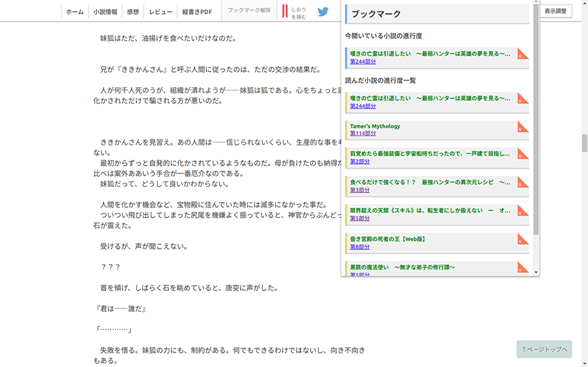
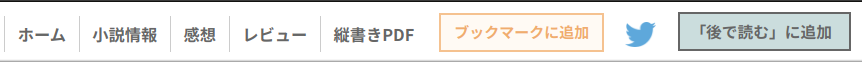
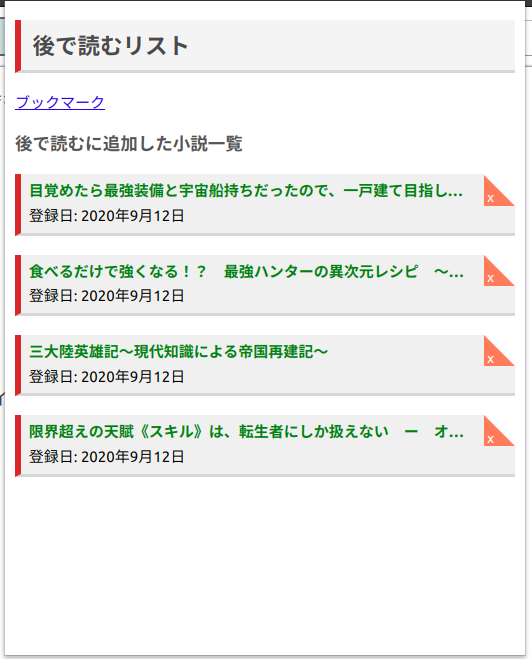

# Seamless Reader

## 概要

[小説家になろう](https://syosetu.com/)に代表されるようなWEB小説サイトで、
スクロールするだけで次のページの内容を自動的に読み込んでくれるchrome拡張です。
非公式なので、サイトから怒られたりすると削除される可能性があります

## 注意

非公式なので、投稿サイトから怒られるなどすると削除される可能性があります。
現在は「小説家になろう」のみ対応しています。

要望・バグ報告・機能提案・開発参加等、大歓迎です。

## 機能

### シームレス読書機能

スクロールするだけで「次へ >>」ボタンを押さずとも、次ページの内容を読み込む機能です。前書きと後書きは飛ばして、本文の内容だけを読み込みます。

### ブックマーク機能

シームレス状態でもどこまで読んだかが分かるようにブックマーク機能がついており、右上の拡張機能アイコンをクリックすると

- 今開いている小説は何部目まで読んでいるか
- 他の小説はそれぞれ何部目まで読んでいるか

といった読書履歴情報が見られるようになっています。

この情報は、シームレスに読み込まれる度にリアルタイムで更新されるので、自分で保存する必要はありません。
もちろん作品ごとに情報を削除することも可能です。

#### ブックマーク機能に関する注意

この機能は「小説家になろう」のブックマーク機能とは完全に別物であり、内容の同期などは一切できません。
また、データはお使いのPCのローカルストレージに保存するので、スマートフォンで読んだ分の履歴が反映されることはありません。
使用するPC毎に履歴が保存されるということになります。

### 「後で読む」機能

「この小説気になるけど今読めるタイミングじゃないし、とりあえずタブだけ開いとくか......」みたいなことありませんか？  
この拡張の作者はそれで常時50個くらいタブが開かれています。  

いくら何でも不便なので「後で読む」ボタンを作って、押したらリストに登録されるようにしました。

便利だと思います。

## インストール

まだ公開できてないです

## 開発方法

このリポジトリをクローンした後、[拡張機能管理画面](chrome://extensions/)に行ってデベロッパーモードを有効にし、
「パッケージ化されていない拡張機能を読み込む」を選択してクローンしたディレクトリを選択する。  
「詳細」「削除」ボタンの右にある更新マークを押すとソースの変更を反映してくれるので便利。
